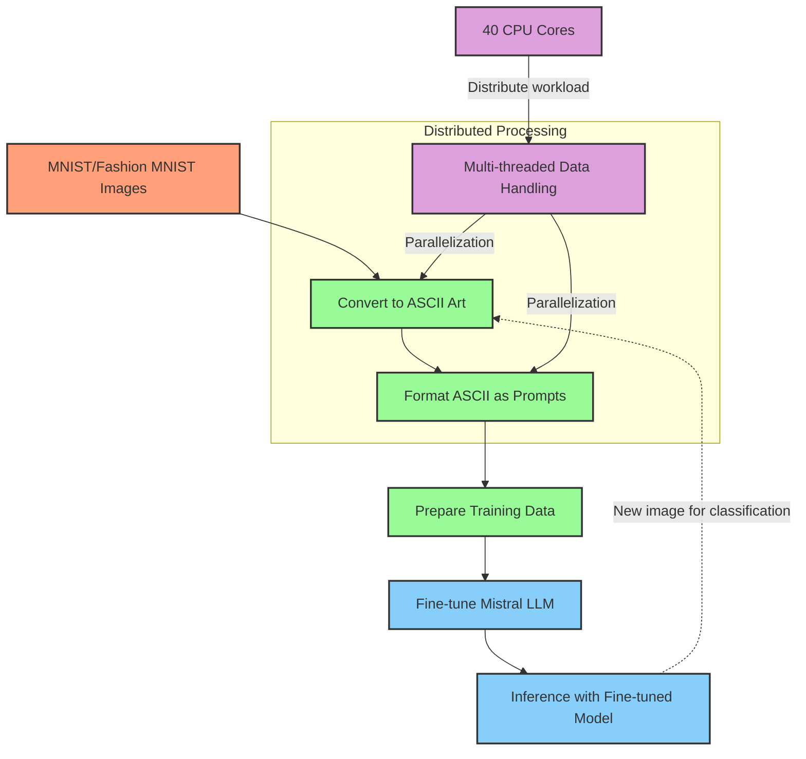

# Mistral Vision: Exploring LLM Fine-tuning for Image Classification

## Project Overview

Mistral Vision is an experimental project that explores the potential of fine-tuning Large Language Models (LLMs) for image classification tasks. By converting images to ASCII representations, this project demonstrates an unconventional approach to adapting text-based models for visual tasks.

## How It Works

1. **Image Preprocessing**: Convert MNIST and FashionMNIST images to ASCII art.
2. **Data Formatting**: Format ASCII art into prompts for the Mistral LLM.
3. **Fine-tuning**: Fine-tune the Mistral model on the ASCII-based dataset.
4. **Inference**: Use the fine-tuned model to classify new ASCII art representations.

Below is the graph detailing the process.



## Key Components

- Image to ASCII conversion
- Data processing with multi-threading
- Integration with MistralAI's API for model fine-tuning and inference
- Handling of MNIST and FashionMNIST datasets

## Repository Structure

- `data_process.py`: Image loading, transformation, and ASCII conversion
- `process_data_before_training.py`: Data preparation for fine-tuning
- `fine_tuning.py`: Fine-tuning process management with MistralAI
- `fine_tuned_results.py`: Inference using the fine-tuned model
- `render_results.py`: Performance analysis and visualization
- `reformat_data.py`: Data reformatting utility

## Distributed Data Processing
A key feature of this project is its highly efficient data handling system. The data processing pipeline is designed to leverage multi-core processors, distributing the workload across multiple threads. This approach significantly reduces processing time, especially when dealing with large datasets like MNIST and FashionMNIST. The multi-threaded design allows for parallel processing of image conversion, ASCII transformation, and data formatting, showcasing scalable data handling techniques essential for large-scale machine learning projects.


## Getting Started

1. Clone the repository:
   ```
   git clone https://github.com/yourusername/mistral-vision.git
   cd mistral-vision
   ```

2. Install dependencies:
   ```
   pip install -r requirements.txt
   ```

3. Process the data:
   ```
   python data_process.py
   python process_data_before_training.py
   ```

4. Fine-tune the model:
   ```
   python fine_tuning.py
   ```

5. Run inference:
   ```
   python fine_tuned_results.py
   ```

6. Analyze results:
   ```
   python render_results.py
   ```

## Model Details

This project uses the `open-mixtral-7b` model. The fine-tuned model can be accessed via MistralAI's API using the job ID: `be2e7a1c-21e3-458a-881c-9d9adca22cef`.

## Hardware Used

Data processing was performed using NVIDIA GPUs, with computation distributed across multiple cores for efficiency.

## Contributing and Future Works

Feedback and contributions are welcome. Feel free to open an issue or submit a pull request.

- Build a new tokenizer for handling the ASCII characters more efficiently

## License

This project is licensed under the MIT License - see the [LICENSE.md](LICENSE.md) file for details.

## Acknowledgments

- MistralAI for their language models and API
- The creators of the MNIST and FashionMNIST datasets

---
